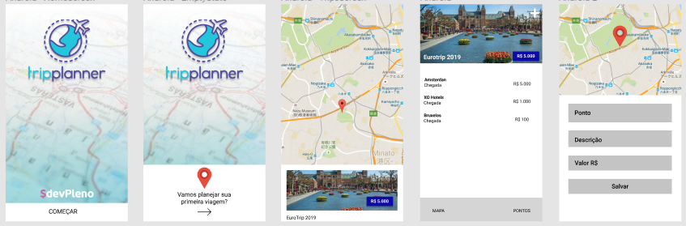

# TripPlanner

TripPlanner is app builded in Hands-on React-Native by DevPleno.

# Figma

The design was build with Figma: the collaborative interface design tool.
https://www.figma.com/




## Importants references links to this project

- [React-Native Getting Started](https://facebook.github.io/react-native/docs/getting-started.html)

- [React-Native Button](https://facebook.github.io/react-native/docs/button)

- [React-Native FlatList](https://facebook.github.io/react-native/docs/flatlist)

- [React-Native Image](https://facebook.github.io/react-native/docs/image)

- [React-Native TextInput](https://facebook.github.io/react-native/docs/textinput)

- [React-Native TouchableOpacity](https://facebook.github.io/react-native/docs/touchableopacity)

- [React-Native AsyncStorage](https://facebook.github.io/react-native/docs/asyncstorage)

- [React-Native Maps](https://github.com/react-native-community/react-native-maps)

- [Google Maps API](https://cloud.google.com/maps-platform/?hl=pt-br)

- [Run on Device](https://facebook.github.io/react-native/docs/running-on-device)


# Running it locally

```bash
git clone https://github.com/AndreLuizGarcia/TripPlanner
```

```bash
npm install
```

```bash
npm install react-native-maps
```

And with the android or ios emulator open, run this command in your terminal : 

```bash
react-native run-ios or react-native run-android
```

# The last but not the least

This project is not ready yet but you can feel comfortable to improve it.

Somethings can be done like finish the CRUD Trip implementing edit and delete trips and points.

The front-end need some improves too.
